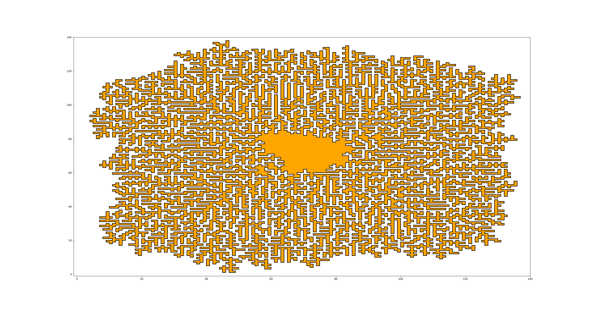

# Day 10

Part II is a nice example of the "point in polygon" problem, see

https://en.wikipedia.org/wiki/Point_in_polygon

My first solution was way too complicated and buggy.
In `pipemaze_v2.py` I used the built-in function from `matplotlib`, which is a
bit faster and yields a more readable code.

A nice side effect is that the pipe maze can be plotted with matplotlib:

